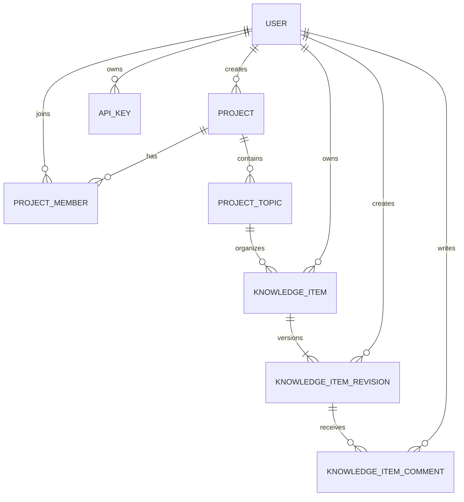
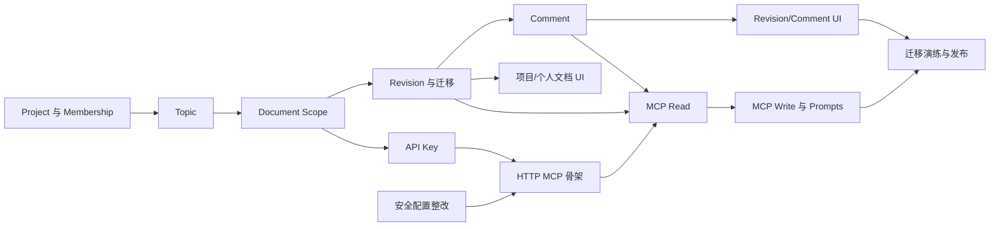

# KnowledgeVault 项目文档、版本评论与 MCP 能力建设计划

> 文档状态：待 Planning Review  
> 创建日期：2026-07-17  
> 本轮范围：需求分析与任务拆分，不包含业务代码实现  
> 适用代码库：Angular 前端 `src/knowledge-vault-web`、ASP.NET Core 后端 `src/KnowledgeVault`

## 1. 目标

把 KnowledgeVault 从“仅支持个人 Knowledge Item 的知识库”扩展为同时支持以下场景的文档工作区：

1. 项目成员围绕“项目 → 主题 → 文档”共同维护 Planning Review、Task Breakdown 等项目文档。
2. 用户继续维护不属于任何项目的个人文档。
3. 文档可关联 Jira Ticket URL，并以 `RW-71677` 这类 Ticket No 作为可点击链接展示。
4. 文档每次保存形成不可变 revision；评论明确关联到某个 revision。
5. 用户可在 Profile 中维护自己的 Nickname，并创建和撤销 API Key。
6. 通过 HTTP 暴露 MCP Server，让 Codex 等 MCP Client 在权限范围内读取和维护文档，服务于 vibe coding。
7. Category 和 Tag 是**系统级（system-level）共享数据**，不属于任何单个用户；所有用户共用同一套分类与标签。维护入口归入 `Preferences`，但编辑会影响全平台。
8. 实现中的页面 Title、导航、字段 Label、按钮和系统提示统一使用 English；用户自己的文档内容和 Nickname 使用什么语言、写什么内容，由用户自行决定。

## 2. 非目标

本阶段不计划：

- 实现实时多人协同编辑、光标同步或 CRDT。
- 同步 Jira Issue 的状态、标题、评论等远端数据；Ticket 仅作为外部链接。
- 实现文档审批流、电子签名或复杂发布流程。
- 实现组织级 RBAC、SSO、SCIM 或全局管理员后台。
- 实现 RAG、Embedding、向量检索或对话问答。
- 让 API Key 管理能力通过 MCP 暴露。
- 首期支持旧版 HTTP+SSE MCP Transport。

## 3. 当前实现基线

### 3.1 后端

- 采用 ASP.NET Core `net10.0`，分为 API、Domain、Contracts、DataAccess、Infrastructure、Providers。
- 当前实际数据库配置使用 EF Core SQL Server；后续 migration 应按 SQL Server 验证。
- `KnowledgeItem` 同时保存标题、正文、摘要和来源地址，更新操作会直接覆盖原内容。
- 所有 Knowledge Item 以 `OwnerUserId` 隔离；Category 与 Tag 为**系统级共享数据，不按 `UserId` 隔离**，全平台用户共用同一套分类与标签。
- 当前只有 JWT Bearer 登录认证，没有 Project、Membership、Topic、Revision、Comment 或 API Key。
- Controller 较薄，业务逻辑集中在 Provider，新增能力应继续遵循这一边界。

### 3.2 前端

- 采用 Angular 21，已有 auth、dashboard、knowledge、categories、tags 等 feature。
- 当前侧边栏为 Dashboard、Knowledge、Categories、Tags。
- 标题栏已显示用户信息和退出按钮，但没有 `Profile` 入口。
- 文档编辑器已支持 Markdown、Category、Tag、Status、Source URL。
- 详情页已支持 Markdown、代码高亮和 Mermaid，可复用于 Planning Review 和 Task Breakdown。

### 3.3 主要差距

| 需求 | 当前状态 | 需要补齐 |
| --- | --- | --- |
| 项目共享 | 仅按创建用户隔离 | Project、ProjectMember、角色和统一授权检查 |
| 主题 | 无 | ProjectTopic 及项目内唯一性 |
| 项目/个人文档 | 只有个人 KnowledgeItem | 文档 Scope 与 Topic 约束 |
| Ticket No 链接 | 只有通用 Source URL | Ticket URL 校验、Ticket No 提取和独立展示 |
| Revision | 保存时覆盖 | 不可变 KnowledgeItemRevision 和并发控制 |
| Revision Comment | 无 | KnowledgeItemComment，强制关联 Revision |
| API Key | 无 | 创建、只显示一次、哈希保存、撤销和 Scope |
| Nickname | 只有登录用 UserName | 用户可选的非唯一显示名，未设置时回退到 UserName |
| HTTP MCP | 无 | Streamable HTTP endpoint、tools/resources/prompts 和认证 |

## 4. 术语与核心约定

- **项目（Project）**：共享协作与权限边界。
- **主题（Topic）**：项目内组织文档的必选容器。
- **文档（Document）**：产品/UI 名称；后端第一阶段继续沿用 `KnowledgeItem` 实体名，降低迁移成本。
- **个人文档（Personal Document）**：仅 Owner 可访问，`Scope = Personal`，不属于 Topic。
- **项目文档（Project Document）**：项目成员按角色访问，`Scope = Project`，必须属于该项目的 Topic。
- **Revision**：文档正文的一次不可变快照。
- **Comment**：针对某个具体 Revision 的讨论记录。
- **Category/Tag**：系统级共享数据，不属于任何单个用户；全平台共用同一套分类与标签，名称在系统范围内唯一。
- **Nickname**：用户自行维护的可选显示名，不作为登录名，不要求唯一；未设置时显示 UserName。

## 5. Planning Review 决策

### 5.1 信息架构与菜单

侧边栏调整为三组。以下名称是实现时必须使用的 English UI Label：

```text
Project Documents
  Project A
  Project B
Personal Documents
Preferences
  Categories
  Tags
```

标题栏用户区域增加 `Profile` 入口，用于管理 Nickname 和 API Key。

建议路由：

| Page Title | 路由 | 说明 |
| --- | --- | --- |
| `Projects` | `/projects` | 创建项目、查看有权访问的项目 |
| `Project Workspace` | `/projects/:projectId` | 展示主题和项目文档 |
| `Topic Documents` | `/projects/:projectId/topics/:topicId` | 主题下的文档列表 |
| `Personal Documents` | `/personal-documents` | 只展示当前用户的个人文档 |
| `Document Details` | `/documents/:documentId` | 当前 revision、版本历史、评论 |
| `Categories` | `/settings/categories` | 迁移现有 Category 页面入口 |
| `Tags` | `/settings/tags` | 迁移现有 Tag 页面入口 |
| `Profile` | `/profile` | Nickname 和 API Key 管理 |

导航行为：

- `Project Documents` 下动态显示当前用户有权限的项目列表。
- 项目较多时只显示最近访问项目，并提供 `All Projects`。
- 点击项目后，主区域展示主题列表；主题内展示文档。
- `Personal Documents` 是独立一级入口，不把个人文档伪装成特殊项目。
- Category/Tag 位于 `Preferences`，但属于**系统级共享配置**，任何用户的编辑都会影响全平台所有文档的分类与标签展示。

#### UI 语言与用户内容规则

- 所有由系统提供的页面 Title、导航、Tab、字段 Label、按钮、Placeholder、状态、空状态、确认框、验证消息和错误提示统一使用 English。
- TypeScript/C# 类型名、属性名、API 字段、路由、MCP Tool/Resource/Prompt 名称统一使用 English。
- 建议统一核心 UI Label：`Project Documents`、`Personal Documents`、`Preferences`、`Categories`、`Tags`、`Profile`、`API Keys`、`Document Type`、`Ticket URL`、`Revision History`、`Comments`、`Change Note`。
- 用户生成的数据不受 UI 语言限制，包括 Nickname、Project/Topic/Category/Tag 名称、Document Title/Summary/Content、Comment 和 Change Note；系统按用户输入原样保存和显示，不自动翻译。
- 用户生成内容允许 Unicode。仅执行必要的 trim、长度、URL 和安全校验；搜索归一化不能改变实际显示文本。
- 内置 Planning Review/Task Breakdown 模板使用 English 作为默认内容，但它只是可完全编辑的初始草稿，用户可改用任意语言和内容。

### 5.2 项目权限模型

首期使用简单的项目角色：

| 操作 | Owner | Editor | Viewer |
| --- | :---: | :---: | :---: |
| 查看项目、主题、文档、revision、评论 | ✓ | ✓ | ✓ |
| 新建/编辑主题 | ✓ | ✓ |  |
| 新建/编辑项目文档 | ✓ | ✓ |  |
| 添加评论 | ✓ | ✓ | ✓ |
| 编辑/删除自己的评论 | ✓ | ✓ | ✓ |
| 管理成员和角色 | ✓ |  |  |
| 修改/归档项目 | ✓ |  |  |

约束：

- Project 创建者自动成为 Owner。
- 一个 Project 至少保留一个 Owner。
- 项目文档的授权由 ProjectMember 决定，不能继续使用 `KnowledgeItem.UserId == currentUserId` 作为唯一条件。
- `KnowledgeItem.OwnerUserId` 表示创建/归属人，不等于项目文档的唯一访问者。
- 所有 REST 和 MCP 调用必须复用同一套 `IProjectAccessService`/文档授权服务。

### 5.3 文档类型

增加 `DocumentType`：

- `General`
- `PlanningReview`
- `TaskBreakdown`

新建文档时允许选择类型，并为后两者提供 Markdown 初始模板：

- Planning Review：目标、范围、非目标、当前状态、方案、数据模型、权限、风险、验收标准、待决问题。
- Task Breakdown：依赖、任务编号、目标、改动位置、验收标准、测试、状态。

DocumentType 在创建文档时设定，创建后不可修改，也不允许通过 metadata PATCH 更新。模板只在创建时初始化一次，不会因后续操作重新套用；如需改变类型，用户应创建新文档。首期不强制 Planning Review 与 Task Breakdown 一一配对；同一 Topic 和 Ticket No 已能完成聚合。文档关系可作为后续增强。

### 5.4 Ticket No 链接

MVP 推荐只让用户输入一个 `ticketUrl`，例如：

```text
https://transfinder.atlassian.net/browse/RW-71677
```

后端从 URL 最后一个 path segment 提取并规范化 `ticketNo = RW-71677`，API 同时返回：

```json
{
  "ticketNo": "RW-71677",
  "ticketUrl": "https://transfinder.atlassian.net/browse/RW-71677"
}
```

规则：

- 仅接受绝对 `https` URL。
- MVP 的 Ticket No 应匹配类似 `[A-Z][A-Z0-9]+-[0-9]+` 的 Jira Key 格式。
- 前端显示 `RW-71677`，使用新标签页打开 URL，并设置 `rel="noopener noreferrer"`。
- Ticket URL 属于 revision 内容的一部分，因此修改 Ticket 会生成新 revision，历史版本仍保留当时链接。
- `SourceUrl` 保留，用于一般来源链接，不能与 Ticket URL 混用。

### 5.5 Revision 模型

采用“文档头 + 当前 revision 指针 + 不可变 revision”结构：



`KnowledgeItem` 保存：

- Id、OwnerUserId
- Scope（Personal/Project）
- TopicId（个人文档为空；项目文档必填）
- DocumentType
- CurrentRevisionId、CurrentRevisionNumber
- CategoryId、Status、PublishedAt、ArchivedAt
- CreatedAt、UpdatedAt
- Tag 关联

`KnowledgeItemRevision` 保存：

- Id、KnowledgeItemId、RevisionNumber
- Title、Summary、Content、SourceUrl
- TicketNo、TicketUrl
- ChangeNote
- CreatedByUserId、CreatedAt

保存规则：

1. 创建文档时在同一事务中创建文档头和 revision 1。
2. 编辑时客户端必须提交 `expectedRevisionNumber`。
3. 服务端在事务中校验 expected revision、插入下一 revision、更新 CurrentRevision 指针。
4. 若其他用户已先保存，返回 `409 Conflict`，前端提示刷新或复制自己的草稿后重试。
5. Revision 一旦创建不可修改或物理删除。
6. 仅 Category、Tag、Status、Topic 等头部元数据变化时，不生成正文 revision，但仍更新审计时间。

### 5.6 Comment 模型

`KnowledgeItemComment` 字段：

- Id
- KnowledgeItemRevisionId
- AuthorUserId
- Content
- CreatedAt、UpdatedAt、DeletedAt

规则：

- Comment 必须关联 revision，不允许只关联 Document。
- 详情页默认显示当前 revision 的评论；切换历史 revision 时同步切换评论。
- 用户可编辑或软删除自己的评论；Project Owner 可做内容治理，但保留审计记录。
- 评论正文首期使用纯文本或受限 Markdown，沿用现有 Markdown sanitization 策略，禁止原始 HTML 注入。
- 新 revision 不复制旧评论；旧评论留在旧 revision 下。

### 5.7 Category 和 Tag 的边界

**结论：Category 和 Tag 为系统级（system-level）共享数据，不属于任何单个用户。**

- 数据库 `Categories` 与 `Tags` 表移除 `UserId` 列及与 `Users` 的外键；名称唯一性约束从 `(UserId, NormalizedName)` 提升为系统范围的 `NormalizedName` 唯一。
- 所有用户（个人文档与项目文档）共用同一套 Category 与 Tag；文档的 `CategoryId` 与 `KnowledgeItemTags` 直接引用系统级分类/标签。
- 任何已认证用户都可读写系统级 Category/Tag；创建/重命名时按系统范围校验名称唯一，避免团队视图不一致。
- 删除 Category 时，系统将其从所有引用该分类的文档（不限 Owner）上解除关联（置 `CategoryId = NULL`）；删除 Tag 时同时清理 `KnowledgeItemTags` 关联行。
- Category/Tag 仅作为文档的辅助组织信息，不用于权限判断或项目导航。
- 维护入口仍归入 `Preferences`（前端 `Categories` / `Tags` 页面），但编辑会影响全平台；如需限制为管理员专属，作为后续增强（如 `TaxonomyAdmin` 角色），不在首期范围。

## 6. 后端设计

### 6.1 新增领域对象

| 对象 | 关键字段/约束 |
| --- | --- |
| Project | Name、Description、OwnerUserId、IsArchived；Owner 可管理 |
| ProjectMember | ProjectId + UserId 唯一；Role；不能删除最后一个 Owner |
| ProjectTopic | ProjectId、Name、Description、SortOrder、IsArchived；项目内规范化名称唯一 |
| KnowledgeItemRevision | Document + RevisionNumber 唯一；内容不可变 |
| KnowledgeItemComment | 必须指向 Revision；支持软删除 |
| ApiKey | UserId、Name、Prefix、SecretHash、Scopes、ExpiresAt、LastUsedAt、RevokedAt |
| User（扩展） | 增加可空 Nickname，最长 64 个 Unicode 字符，不唯一；空值显示 UserName |

### 6.2 KnowledgeItem 调整

- 采用低风险兼容策略：C# 领域属性从 `UserId` 重命名为 `OwnerUserId`，SQL Server 物理列继续保留 `UserId`，在 EF Core 中使用 `HasColumnName("UserId")` 显式映射。本阶段不新增重复 OwnerUserId 列，也不物理重命名已有列。
- 新增 `Scope`、`TopicId`、`DocumentType`、`CurrentRevisionId`、`CurrentRevisionNumber`。
- Title、Content、Summary、SourceUrl 迁入 Revision；过渡期可保留只读兼容映射，最终删除重复列。
- 新增数据库 Check Constraint：Personal 时 TopicId 必须为空，Project 时 TopicId 必须非空。
- 项目归属通过 Topic → Project 推导，不在 KnowledgeItem 冗余 ProjectId。
- `DocumentType` 是 create-only 字段，不出现在 Update Document 或 metadata PATCH contract 中；服务端不能接受创建后的类型变更。

### 6.3 Provider 边界

建议新增：

- `IProjectProvider`：项目 CRUD、成员管理。
- `ITopicProvider`：主题 CRUD 和排序。
- `IDocumentProvider`：替代/演进 `IKnowledgeItemProvider`，处理个人/项目列表和 revision 写入。
- `IRevisionProvider`：历史列表和指定 revision 读取。
- `ICommentProvider`：revision 评论 CRUD。
- `IApiKeyProvider`：API Key 生命周期管理。
- `IDocumentAccessService`：集中判断个人 Owner 或项目角色。
- `ITicketReferenceParser`：校验 URL 并提取 Ticket No。

Controller 继续保持参数绑定和 HTTP 状态码映射，不能复制授权规则。

### 6.4 REST API 草案

统一分页契约：

- 所有可能增长的列表接口统一接受 `page` 和 `pageSize`：`page` 从 1 开始，默认 1；`pageSize` 默认 20，允许 1–100。
- REST 和 MCP list/search Tool 共用同一输入名称及 `PagedResult<T>` 输出：`items`、`page`、`pageSize`、`totalCount`、`totalPages`。
- 默认排序必须稳定：文档按 `updatedAt DESC, id ASC`；Revision 按 `revisionNumber DESC`；Comment 按 `createdAt ASC, id ASC`。允许排序的接口只接受白名单字段。
- 超出最大 `pageSize` 返回 validation error，不静默放大；前端列表必须分页加载，不能固定请求全部数据。

项目与主题：

| 方法 | Endpoint | 用途 |
| --- | --- | --- |
| GET/POST | `/api/projects` | 列出/创建项目 |
| GET/PUT/DELETE | `/api/projects/{projectId}` | 读取/修改/归档项目 |
| GET/POST | `/api/projects/{projectId}/members` | 列出/添加成员 |
| PUT/DELETE | `/api/projects/{projectId}/members/{userId}` | 修改角色/移除成员 |
| GET/POST | `/api/projects/{projectId}/topics` | 列出/创建主题 |
| PUT/DELETE | `/api/projects/{projectId}/topics/{topicId}` | 修改/归档主题 |

文档与版本：

| 方法 | Endpoint | 用途 |
| --- | --- | --- |
| GET/POST | `/api/documents` | 按统一查询参数分页查询，或创建文档 |
| GET/PUT/DELETE | `/api/documents/{documentId}` | 当前 revision、保存新 revision、软删除 |
| PATCH | `/api/documents/{documentId}/metadata` | 仅更新 Topic/Category/Tag/Status；不接受 DocumentType |
| GET | `/api/documents/{documentId}/revisions` | 分页读取 revision 摘要列表 |
| GET | `/api/documents/{documentId}/revisions/{revisionNumber}` | 指定 revision 详情 |
| GET/POST | `/api/documents/{documentId}/revisions/{revisionNumber}/comments` | 分页读取评论/新增评论 |
| PUT/DELETE | `/api/comments/{commentId}` | 编辑/软删除自己的评论 |

`GET /api/documents` 查询参数草案：

| 参数 | 类型/默认值 | 规则 |
| --- | --- | --- |
| `scope` | `Personal` 或 `Project`，必填 | 避免一次请求意外混合个人和项目数据 |
| `projectId` | Guid，可空 | `scope=Project` 时允许；与 Topic 的 Project 必须一致 |
| `topicId` | Guid，可空 | 筛选指定 Topic；Project 文档创建时必填 |
| `documentType` | `General`/`PlanningReview`/`TaskBreakdown`，可空 | 只用于筛选，不能用于修改现有文档类型 |
| `ticketNo` | string，可空 | 按规范化 Jira Key 精确匹配 |
| `query` | string，可空 | 搜索当前 revision 的 Title、Summary、Content |
| `categoryId` | Guid，可空 | 按系统级 Category 筛选 |
| `tagIds` | Guid 数组，可空 | 多个 Tag 默认采用 AND 语义，与现有行为一致 |
| `status` | Document Status，可空 | 默认排除 Deleted |
| `sort` | enum，默认 `updatedAtDesc` | MVP 支持 `updatedAtDesc`、`createdAtDesc`、`titleAsc` |
| `page` | int，默认 1 | 最小 1 |
| `pageSize` | int，默认 20 | 1–100 |

`GET /api/documents/{id}/revisions` 和 Comment 列表使用相同 `page/pageSize` 约定；Project、Topic、Member 等增长型列表也应采用该契约。

Profile and API Keys：

| 方法 | Endpoint | 用途 |
| --- | --- | --- |
| GET/PUT | `/api/profile` | 读取/更新当前用户 Nickname；空值表示回退到 UserName |
| GET/POST | `/api/profile/api-keys` | 列出元数据/创建 API Key |
| DELETE | `/api/profile/api-keys/{apiKeyId}` | 撤销 API Key |

兼容策略：

- `/api/documents` 作为新 canonical API。
- 前端迁移完成前保留 `/api/knowledge-items`，内部委托给同一 Document Provider。
- 兼容 API 不暴露 revision/comment 新能力，并在后续版本删除。

### 6.5 API Key 安全设计

API Key 格式示例：`kv_<public-prefix>_<random-secret>`。

- 使用密码学安全随机数，原始 Key 只在创建成功响应中显示一次。
- 数据库只保存 Prefix 和 SecretHash，不保存明文；高熵随机 Key 可使用 SHA-256/HMAC-SHA-256 并做恒定时间比较。
- 创建请求中的 `expiresInDays` 可省略；省略时默认 90 天，允许范围为 1–365 天，MVP 不允许永不过期的 Key。
- Key 支持名称、Scope、ExpiresAt、LastUsedAt 和撤销时间；创建响应必须返回服务端最终计算的 ExpiresAt。
- 首期 Scope：`documents:read`、`documents:write`、`comments:read`、`comments:write`、`projects:read`。
- API Key 使用 `Authorization: Bearer <api-key>`，不放 query string，不写入日志。
- JWT 和 API Key 通过 ASP.NET Core policy scheme 或独立 authentication handler 统一映射到 `ICurrentUserContext`。
- API Key 只能代表创建它的用户，仍需经过项目成员权限检查。
- MCP endpoint 增加独立限流策略、请求体上限、审计日志和 Key 级撤销。

安全前置项：当前配置文件和 DataAccess fallback 中存在开发环境凭据/Signing Key。开放远程 MCP 前必须迁移到 User Secrets、环境变量或 Secret Store，并轮换已暴露凭据。

## 7. MCP 设计

### 7.1 Transport 与 Endpoint

- 使用官方 C# MCP SDK 的 ASP.NET Core 集成。
- 暴露单一 `/mcp` endpoint，支持 Streamable HTTP 的 POST/GET。
- MVP 使用 stateless 模式，不依赖跨请求 session，降低 IIS/多实例部署复杂度。
- 对每个请求检查 `Origin`：若 Header 存在，必须与配置的精确 allowlist 匹配；非法值或 `Origin: null` 返回 403，即使 API Key 有效也不能绕过。
- Codex、MCP Inspector 等非浏览器客户端通常不发送 `Origin`；Header 缺失时允许请求继续进入认证流程，但仍必须提供有效 API Key/OAuth token，否则返回 401。
- Browser Client 必须配置明确 Origin，不允许在携带凭据时使用 wildcard；本地部署同时限制监听地址，避免 DNS rebinding。
- 仅通过 HTTPS 暴露；认证信息每个请求都必须携带。
- MCP 工具直接调用 Provider/Access Service，不通过 HTTP 回调自己的 REST API。

### 7.2 MCP 能力清单

Resources：

| URI | 内容 |
| --- | --- |
| `knowledge-vault://documents/{id}` | 当前 revision 的文档 |
| `knowledge-vault://documents/{id}/revisions/{number}` | 指定历史 revision |
| `knowledge-vault://documents/{id}/revisions/{number}/comments{?page,pageSize}` | 指定 revision 的分页评论 Resource Template，可直接通过 resources/read 获取 |
| `knowledge-vault://projects/{projectId}/topics/{topicId}` | 主题及其文档索引 |

Tools：

| Tool | 权限 Scope | 用途 |
| --- | --- | --- |
| `list_projects` | projects:read | 列出可访问项目 |
| `list_topics` | projects:read | 列出项目主题 |
| `search_documents` | documents:read | 按 scope/project/topic/type/ticket/query 查询 |
| `get_document` | documents:read | 获取当前或指定 revision |
| `create_document` | documents:write | 创建个人或项目文档 |
| `update_document` | documents:write | 基于 expectedRevisionNumber 创建新 revision |
| `list_revisions` | documents:read | 查看 revision 历史 |
| `list_comments` | comments:read | 查看指定 revision 评论 |
| `add_comment` | comments:write | 给指定 revision 添加评论 |

`list_projects`、`list_topics`、`search_documents`、`list_revisions`、`list_comments` 统一接受 `page/pageSize`，并返回与 REST 相同的 `PagedResult<T>`。Comment Resource Template 也使用相同参数，`pageSize` 上限为 100。

Prompts：

| Prompt | 输入 | 作用 |
| --- | --- | --- |
| `planning_review` | project/topic/ticket/context | 生成符合项目模板的 review 草稿 |
| `task_breakdown` | planning document/revision | 引导把已确认方案拆成可执行任务 |

首期不通过 MCP 提供项目成员管理、API Key 管理、Category/Tag 删除等高影响操作。

### 7.3 API Key 与 MCP 标准兼容说明

静态 API Key Bearer 方案适合 MVP 和支持自定义 Header 的客户端，但它不是完整的 MCP OAuth 授权发现流程。当前 MCP HTTP 授权规范推荐 OAuth 2.1、Protected Resource Metadata 和授权服务器发现。

因此分两步：

1. **MVP**：API Key Bearer + 手工配置 Header；清楚标记为预配置凭据模式。
2. **兼容增强**：增加 `/.well-known/oauth-protected-resource`、`WWW-Authenticate` challenge、OAuth/OIDC 授权服务器和细粒度 Scope，支持客户端自动授权发现。

### 7.4 MCP 返回格式原则

- Tool 同时返回简洁文本和 `structuredContent`，便于模型理解及客户端可靠消费。
- 所有 ID、revision number、scope、project/topic 信息显式返回。
- `update_document` 遇到版本冲突时返回可自我修正的 Tool Execution Error，包含 currentRevisionNumber。
- 查询结果使用 §6.4 的 `page/pageSize` 和 `PagedResult<T>`，并限制单次正文总量，避免上下文爆炸。
- Tool 列表和输出字段保持确定性排序，便于客户端缓存。

## 8. 数据迁移方案

现有数据不能丢失，采用 expand → backfill → switch → contract，按以下顺序执行：

1. 部署前创建可验证的 SQL Server full backup；生产启用 PITR 时同时记录 restore point，并在生产数据副本验证 restore。
2. 先把 C# `KnowledgeItem.UserId` 属性改名为 `OwnerUserId`，通过 EF `HasColumnName("UserId")` 继续映射现有物理列。该步骤不移动数据，也不新增 OwnerUserId 列。
3. 新建 Project、ProjectMember、ProjectTopic、Revision、Comment、ApiKey 表；给 User 增加可空 Nickname；给 KnowledgeItem 增加可空 Scope/CurrentRevision 等过渡列。
4. 所有现有 KnowledgeItem 回填为 `Scope = Personal`。
5. 把每个现有 Item 的 Title、Content、Summary、SourceUrl 复制为 revision 1。
6. 设置 CurrentRevisionId/CurrentRevisionNumber，并逐项核对 Item 数量、内容 Hash、Owner 和关联。
7. 写入并验证非空约束、Check Constraint 和索引；索引在 EF 中引用 OwnerUserId，SQL Server 中仍落到物理列 UserId。
8. 部署兼容新旧正文列的应用版本，切换为 revision 写入和读取，同时保留旧列以支持短期应用回滚。
9. 观察并通过回滚窗口，确认新旧查询、权限、性能和审计指标后，才进入 contract migration。
10. 再次备份数据库后删除 KnowledgeItem 上的旧正文列；物理列 `UserId` 是否改名为 `OwnerUserId` 留作独立低风险 migration，不与本次功能迁移绑定。

关键索引：

- ProjectMember `(ProjectId, UserId)` unique。
- ProjectTopic `(ProjectId, NormalizedName)` unique。
- KnowledgeItemRevision `(KnowledgeItemId, RevisionNumber)` unique。
- KnowledgeItem 领域索引 `(OwnerUserId, Scope, Status)`，首期对应 SQL Server 物理列 `(UserId, Scope, Status)`。
- KnowledgeItem `(TopicId, Status)`。
- Comment `(KnowledgeItemRevisionId, CreatedAt)`。
- ApiKey `Prefix`，并在候选匹配后比较完整 Hash。

回滚机制：

- Expand/backfill 阶段在尚无新模型写入时，可以使用已验证的 EF Down migration 撤销纯新增对象。
- Switch 后优先回滚应用到仍兼容旧列的上一版本；不能执行会删除已经产生的 Revision、Comment 或 API Key 数据的 Down migration。
- 新模型已产生有效写入后，数据库问题优先 forward fix。只有灾难恢复才使用 full backup/PITR 与应用版本协调还原，并按发布前确认的 RPO/RTO 接受还原点之后的数据损失。
- Contract migration 删除旧列后，不再承诺直接应用回滚；必须通过 forward fix 或经过演练的数据库还原恢复。
- KV-019 必须记录 backup identifier、restore 命令/Runbook、预计恢复时长、数据校验 SQL 和回滚决策人。

## 9. 前端交互计划

### 9.1 项目工作区

- `Projects` 页面支持创建、编辑、归档。
- 项目详情左侧/顶部为 Topic，主区域为文档列表。
- Owner 可打开成员管理；Editor/Viewer 只看到允许操作。
- 创建项目文档时 Project 和 Topic 从当前路由预填。

### 9.2 个人文档

- 复用现有 Knowledge List/Editor，但查询固定为 `scope=Personal`。
- UI 文案统一从 `Knowledge Item` 改为 `Document`。
- 个人文档编辑时不显示 Project/Topic。

### 9.3 文档详情

推荐三栏/区域结构：

```text
Document Content | Revision History | Comments
```

- 顶部使用 English Label 展示 `Document Type`、`Project`、`Topic`、`Category`、`Tags`、`Status` 和 `Ticket` 链接。
- `Revision History` 展示版本号、作者、时间和 `Change Note`。
- 选择历史 revision 后正文与评论同步切换，并明确标记 `Historical Revision — Read Only`。
- 编辑当前文档时携带 expectedRevisionNumber；409 时保留用户输入并提示冲突。

### 9.4 Profile / API Keys

- `Profile` 页面提供 `Nickname` 字段。用户可输入任意语言的 Unicode 显示名，最长 64 个字符，不要求唯一；清空后回退显示 UserName。
- Topbar、Comment Author、Revision Author 优先显示 Nickname，未设置时显示 UserName；认证与成员匹配仍使用 UserId/UserName，不使用 Nickname。
- API Key 列表只显示名称、Prefix、Scope、创建/过期/最后使用时间和状态。
- 创建 API Key 时 `Expiration` 默认 90 days，可选择 1–365 days，不提供 `Never Expires`。
- 创建后只弹出一次完整 Key，要求用户复制；关闭后无法再次查看。
- 撤销操作二次确认，撤销后立即失效。
- 页面提供 MCP Client 配置示例，但示例不得把真实 Key 写入源码或截图。

## 10. Task Breakdown

任务编号是本计划内部编号，实施时可映射为 Jira Ticket。

> 状态图例：【已完成】已实现并通过编译；【待做】尚未开始；【第二阶段/暂缓】按原计划延后到第二阶段。
> 截至 2026-07-17 已完成：KV-001、KV-002、KV-003、KV-004、KV-005、KV-006、KV-011、KV-018，以及将 Category/Tag 由用户级改为系统级共享（见 §5.7，已落到代码与迁移 `SystemLevelCategoriesTags`）。

### Epic A：模型与迁移基础

#### KV-001 建立 Project 与 Membership 领域模型 【已完成】

- 后端：Domain、DbContext、Contracts、Provider、Controller、DI。
- 验收：创建者为 Owner；项目列表只返回当前用户所属项目；最后一个 Owner 不能被移除。
- 测试：角色矩阵、越权访问、唯一成员约束、归档项目。
- 依赖：无。

#### KV-002 建立 ProjectTopic 【已完成】

- 后端：Topic CRUD、排序、归档、项目内名称唯一。
- 验收：只有 Owner/Editor 可写；Viewer 可读；归档 Topic 不允许新增文档。
- 依赖：KV-001。

#### KV-003 扩展 KnowledgeItem 的 Scope 与 DocumentType 【已完成】

- 后端：Personal/Project 约束、OwnerUserId CLR 属性到现有 UserId 列的映射、Topic 关联、查询过滤。
- 验收：个人文档 Topic 为空；项目文档必须挂有效 Topic；DocumentType 创建后不可修改；所有列表都经过授权过滤。
- 依赖：KV-001、KV-002。

#### KV-004 引入 Revision 与数据回填 【已完成】

- 后端：Revision entity、当前版本指针、expectedRevisionNumber、事务与 409。
- 数据：把现有 Item 全部迁为个人文档 revision 1。
- 验收：保存创建新 revision，不覆盖旧正文；历史版本可读；现有数据数量、内容 Hash、Owner 和关联校验一致；保留兼容回滚窗口。
- 依赖：KV-003。

#### KV-005 Ticket URL 与 Ticket No 【已完成】

- 后端：parser/validator、DTO 和 revision 字段。
- 前端：编辑输入、列表与详情链接展示。
- 验收：示例 URL 显示 `RW-71677`，点击打开原 URL；非法 scheme/key 返回清晰验证错误。
- 依赖：KV-004。

### Epic B：评论与协作体验

#### KV-006 Revision Comment API 【已完成】

- 后端：评论新增、列表、编辑、软删除和授权。
- 验收：评论强制绑定 revision；新 revision 不复制旧评论；用户只能编辑自己的评论。
- 依赖：KV-004。

#### KV-007 重构侧边栏和路由 【待做】

- 前端：`Project Documents` 动态列表、`Personal Documents`、`Preferences` 分组和 `Profile` 入口。
- 验收：刷新深层路由可恢复页面；移动端菜单可访问；原 Category/Tag 页面功能不回退；所有系统 UI Label 使用 English。
- 依赖：KV-001、KV-002、KV-003。

#### KV-008 项目与主题管理 UI 【待做】

- 前端：Project CRUD、Topic CRUD、成员/角色管理。
- 验收：操作入口与后端角色一致；错误和空状态完整。
- 依赖：KV-001、KV-002、KV-007。

#### KV-009 文档列表与编辑器按 Scope 重构 【待做】

- 前端：复用组件，区分项目/个人查询与创建上下文；增加 DocumentType 模板。
- 验收：个人和项目文档不串数据；项目创建时 Topic 必填；DocumentType 创建后不可编辑；模板可编辑且不限制用户内容语言；列表使用统一分页契约。
- 依赖：KV-003、KV-007、KV-008。

#### KV-010 Revision/Comment 详情体验 【待做】

- 前端：版本历史、历史只读视图、评论面板、ChangeNote、409 冲突处理。
- 验收：切换 revision 同步切换正文和评论；冲突时用户草稿不丢失；Page Title、Tab、Label、Button、状态和消息均使用 English。
- 依赖：KV-004、KV-006、KV-009。

### Epic C：API Key 与 MCP

#### KV-011 API Key 生命周期与认证 Handler 【已完成】

- 后端：生成、哈希、Scope、默认 90 天及 1–365 天过期校验、撤销、LastUsedAt、日志脱敏。
- 验收：完整 Key 只返回一次；不允许永不过期；撤销立即生效；JWT 行为不回退；Key 无法越过项目权限。
- 依赖：KV-001、KV-003。

#### KV-012 Profile、Nickname 与 API Key UI 【待做】

- 后端/前端：扩展 User Nickname 与 Profile API；实现 API Key 列表、创建、一次性复制、撤销和 MCP 配置说明。
- 验收：Nickname 接受用户选择的 Unicode 内容、非唯一、空值回退 UserName；刷新后无法重新获取 Key 明文；状态/过期时间准确显示；所有 UI Label 使用 English。
- 依赖：KV-007、KV-011。

#### KV-013 建立 HTTP MCP Server 骨架 【待做】

- 后端：官方 C# SDK、`/mcp`、stateless Streamable HTTP、Origin 校验、API Key 认证、限流和审计。
- 验收：MCP Inspector 和至少一个真实目标 Client 能初始化、列出 capabilities；缺少 Origin 的非浏览器请求在有效认证后可用；存在但非法的 Origin 无论认证状态均返回 403；未授权请求返回 401。
- 依赖：KV-011。

#### KV-014 MCP Read 能力 【待做】

- 后端：projects/topics/documents/revisions/comments 的 Resources、Comment Resource Template 和只读 Tools。
- 验收：Comment 可通过 resources/read 或 list_comments 获取；MCP 和 REST 使用相同 `page/pageSize` 与 PagedResult；权限范围及正文上限一致；无法读取非成员项目。
- 依赖：KV-004、KV-006、KV-013。

#### KV-015 MCP Write 能力与 Prompts 【待做】

- 后端：create/update document、add comment、Planning Review/Task Breakdown prompts。
- 验收：写入生成 revision；expectedRevision 冲突可识别；API Key Scope 生效；MCP 不暴露 Key/成员管理。
- 依赖：KV-005、KV-006、KV-014。

#### KV-016 OAuth 兼容增强（第二阶段） 【第二阶段/暂缓】

- 后端/部署：Protected Resource Metadata、OAuth/OIDC discovery、Scope challenge。
- 验收：兼容客户端可自动发现并完成授权；token audience、scope、401/403 符合规范。
- 依赖：KV-013；不阻塞 API Key MVP。

### Epic D：质量、运维与发布

#### KV-017 自动化测试基础 【待做】

- 新增后端测试项目，覆盖 Provider、授权和 migration；扩展 Angular component/service tests。
- 验收：核心权限矩阵、revision 并发、分页、Nickname、API Key、MCP Origin/Resources/Tools 均有自动化测试。
- 可与 Epic A 并行启动，并随任务持续补齐。

#### KV-018 安全配置整改 【已完成·本次复核修复】

- 移除源码中的数据库凭据和 JWT Signing Key fallback，改用 Secret Store/环境变量并轮换。
- 验收：仓库不含有效明文 Secret；缺少必要配置时启动快速失败且错误不泄密。
- 依赖：无；必须在 KV-013 部署前完成。
- **2026-07-17 复核修复（本提交）**：
  - 发现 `appsettings.Development.json` 仍被 git 跟踪且含真实 SQL 账号密码（`User ID=Jzhong1985;Password=...`），已 `git rm --cached` 停止跟踪，并由 `.gitignore` 第 41 行持续忽略（本地文件保留、不再入库）。
  - 跟踪中的 `appsettings.json` 改为 `${KV_DB_CONNECTION}` / `${KV_JWT_SIGNING_KEY}` 环境变量占位，不再含明文密钥；实际值由本地 `appsettings.Development.json`（已忽略）或部署环境变量提供。
  - NuGet 高危漏洞：`Microsoft.OpenApi` 2.4.1（GHSA-v5pm-xwqc-g5wc，High）经 `Swashbuckle.AspNetCore` / `Microsoft.AspNetCore.OpenApi` 传递引入，已在 `KnowledgeVault.csproj` 直接钉到已修复版本 `2.7.5`，`dotnet list package --vulnerable` 已无高危项。
  - 注意：该密码曾进入 git 历史，建议在生产/本地 SQL 实例**轮换该账号密码**，并按需对历史做清理（BFG/filter-repo 为破坏性操作，需另行确认）。

#### KV-019 迁移演练与发布 【待做】

- 在生产数据副本演练 expand/backfill/switch/contract migration、full backup/PITR restore、性能和权限抽样。
- 分阶段启用：数据库 → REST → 新 UI → API Key → MCP Read → MCP Write。
- 验收：旧数据核对通过；backup identifier、RPO/RTO、恢复 Runbook、校验 SQL 和决策人均有记录；监控 401/403/409/429 和 MCP tool errors；应用回滚、forward fix 和灾难还原路径验证有效。
- 依赖：KV-001 至 KV-015、KV-017、KV-018。

## 11. 推荐实施顺序



建议切成三个可独立验收的里程碑：

1. **M1 文档协作基础**：Project、Topic、Scope、Revision、Comment、项目/个人 UI。
2. **M2 Vibe Coding 接入**：API Key、MCP Read、Planning/Task Prompts。
3. **M3 安全写入与兼容**：MCP Write、OAuth discovery、运维与发布加固。

## 12. 测试策略

### 12.1 后端

- Provider 单元/集成测试：个人 Owner、项目 Owner/Editor/Viewer、非成员。
- EF Core 集成测试使用与生产一致的 SQL Server 行为验证约束和事务，而不是只依赖 InMemory provider。
- Revision 并发测试：两个相同 expected revision 更新，仅一个成功，另一个 409。
- Migration 测试：旧库升级、OwnerUserId 到物理 UserId 映射、revision 1 回填、数量/内容 Hash/关联核对及回滚 Runbook。
- 分页测试：REST/MCP 的默认值、边界 1/100、超限错误、稳定排序和 PagedResult 一致性。
- Nickname 测试：Unicode、最长 64 字符、非唯一、空值回退 UserName，并确保不参与认证。
- API Key：默认 90 天、1–365 天边界、禁止永不过期、Hash、撤销、Scope、日志脱敏、恒定时间比较路径。
- MCP contract：initialize、tools/list、resources/read、tools/call；缺少/合法/非法 Origin；401/403/409/429。

### 12.2 前端

- 路由和菜单按角色/Scope 显示。
- 所有 Page Title、导航、Tab、Label、Button、Placeholder、状态、空状态和消息使用 English。
- Personal/Project 查询参数不串用；列表正确使用 `page/pageSize` 并处理 totalPages。
- 用户输入的 Unicode Nickname、Document Content/Title 和 Comment 原样显示，不被翻译或改写。
- Ticket URL 校验及安全链接属性。
- Revision 切换、历史只读、评论切换。
- 409 冲突时草稿保留。
- API Key 只显示一次、1–365 days 过期选择与撤销确认。

### 12.3 端到端验收场景

1. 用户 A 创建项目、主题并邀请用户 B 为 Editor、用户 C 为 Viewer。
2. B 创建 Planning Review 文档并关联 RW-71677。
3. A 和 B 基于同一版本编辑，确认冲突不会覆盖另一方修改。
4. C 查看历史 revision 并评论，但不能修改文档。
5. B 创建 API Key，MCP Client 能读取项目文档并生成 Task Breakdown。
6. Read-only Key 调用写 Tool 被拒绝，撤销 Key 后所有 MCP 请求立即失败。
7. 非项目成员无法通过 REST、猜测 URL 或 MCP 读取任何项目数据。
8. 用户设置非 English Nickname 并撰写任意语言的文档/评论；UI chrome 保持 English，用户内容保持原样。
9. 无 Origin 的 Codex/MCP Inspector 请求在认证成功后可用；携带非法 Origin 的请求即使 API Key 正确也返回 403。
10. 文档、Revision 和 Comment 数据超过单页后，REST、Web 和 MCP 使用相同分页结果且无重复/漏项。

## 13. 风险与应对

| 风险 | 影响 | 应对 |
| --- | --- | --- |
| 在每个 Provider 中重复权限判断 | 容易出现 REST/MCP 越权差异 | 集中 `IDocumentAccessService`，权限矩阵自动化测试 |
| Revision migration 改动大 | 数据丢失或长时间锁表 | expand/contract、批量回填、full backup/PITR 演练；新模型写入后优先 forward fix，不做破坏性 Down migration |
| 项目 Tag/Category 语义不清 | 团队视图不一致 | 已决定为系统级共享分类/标签，名称系统范围唯一，团队视图天然一致 |
| 静态 API Key 被误认为 OAuth | 某些 MCP Client 无法自动连接 | 文档明确手工 Header 模式，第二阶段实现标准 discovery |
| API Key 或现有 Secret 泄露 | 远程数据被访问 | 只存 Hash、日志脱敏、Scope/过期/撤销、发布前 Secret 整改 |
| 长文档通过 MCP 返回过多 | 上下文和延迟失控 | 分页、正文大小上限、摘要列表、按需读取 revision |
| 多人覆盖更新 | 丢失编辑内容 | expectedRevisionNumber + 409 + 前端草稿保留 |
| SDK/协议继续演进 | MCP 行为漂移 | 固定并记录 SDK 版本，集成测试目标 Client，升级走独立任务 |

## 14. Planning Review 待确认项

以下问题不阻塞计划编写，但应在对应任务开工前确认：

1. ~~Category/Tag 是继续用户级，还是项目需要共享的 Category/Tag？~~ 已决定：**系统级共享**，不属于任何单个用户，名称在系统范围内唯一（见 §5.7）。
2. Project 成员通过“已有用户名/邮箱”添加是否足够，还是需要邮件邀请流程？本计划默认只添加已注册用户。
3. Viewer 是否允许评论？本计划默认允许。
4. Ticket URL 是否只允许指定 Atlassian 域名？本计划默认允许任意 HTTPS 域名，但 Ticket Key 必须符合 Jira 格式。
5. MCP 首批目标客户端有哪些？实施 KV-013 前至少确定 MCP Inspector + 一个真实客户端作为兼容基线。

## 15. Definition of Done

本能力整体完成需满足：

- 用户能通过 English UI 清晰访问 `Project Documents`、`Personal Documents`、`Preferences` 和 `Profile`。
- 所有系统 Page Title、导航、Label、Button 和消息使用 English；用户自己的 Nickname、文档内容及其他用户生成数据可使用任意语言并原样保存。
- 项目/主题/成员权限在 UI、REST、MCP 三个入口行为一致。
- 现有 Knowledge Item 无损迁移为个人文档 revision 1；领域 OwnerUserId 正确映射现有数据库 UserId 列。
- DocumentType 只在创建时设定，之后不能通过正文或 metadata API 修改。
- 每次正文保存生成不可变 revision，评论严格属于指定 revision。
- Jira URL 以 Ticket No 显示并安全跳转。
- REST、Web 和 MCP 增长型列表使用统一 `page/pageSize` 与 PagedResult 契约。
- 用户可以维护 Nickname；创建、查看元数据、撤销自己的 API Key，明文只显示一次，Key 默认 90 天且只允许 1–365 天。
- MCP 通过 HTTPS Streamable HTTP 提供已定义的 read/write 能力，Scope 和项目权限均有效；Comment 支持直接 Resource Read 和 Tool 分页读取。
- 无 Origin 的合法非浏览器 MCP Client 可认证使用；任何存在但非法的 Origin 均返回 403。
- 核心权限、迁移、并发、API Key 和 MCP 行为有自动化测试。
- 源码不包含有效数据库密码、JWT Signing Key 或 API Key。
- 上线前完成 full backup/PITR restore、expand/contract migration、监控、应用回滚、forward fix 和灾难恢复 Runbook 验证。

## 16. 参考资料

- [MCP Streamable HTTP Transport（2025-11-25）](https://modelcontextprotocol.io/specification/2025-11-25/basic/transports)
- [MCP HTTP Authorization（2025-11-25）](https://modelcontextprotocol.io/specification/2025-11-25/basic/authorization)
- [MCP Resources](https://modelcontextprotocol.io/specification/2025-11-25/server/resources)
- [MCP Tools](https://modelcontextprotocol.io/specification/2025-11-25/server/tools)
- [Official MCP C# SDK](https://github.com/modelcontextprotocol/csharp-sdk)

---

## 17. 部署与验证现状（2026-07-17 会话记录）

> 本节记录本次部署联调会话的发现与未完成任务，供后续会话继续。

### 17.1 部署拓扑（已确认）

- 前端：构建产物位于 `D:\AI\Projects\KnowledgeVault\src\knowledge-vault-web\dist\knowledge-vault-web\browser`，`index.csr.html` 为 SPA 外壳（IIS `web.config` 已配置 rewrite 到该文件）。
- 访问地址：`http://localhost/KnowledgeVaultWeb/knowledge`（IIS 端口 80，虚拟目录 `KnowledgeVaultWeb`，base href 为 `/KnowledgeVaultWeb/`）。
- 后端 WebAPI：部署于 `D:\Web\KnowledgeVault`，对外路由前缀 `/KnowledgeVault/api` 与 `/KnowledgeVault/mcp`。
- **约束**：`D:\Web\KnowledgeVault\web.config` 与前端 `web.config` 不要随意改动（用户明确要求）。

### 17.2 已验证通过

- 前端站点 HTTP 200；API/MCP 未带认证时正确返回 401。
- 登录（`/api/auth/login`）正常；`GET /api/documents`（列表）、`GET /api/projects`、`GET /api/profile`、`GET /api/profile/api-keys` 均返回 200（注：前端调用路径为 `/profile/api-keys` 带连字符，早期测试用 `apikeys` 误报 404）。

### 17.3 未完成任务 / 待排查问题

- **KV-DEP-1（高）：文档创建返回 500**。`POST /api/documents` 在部署环境抛 500，真实异常被通用错误处理器吞掉。需打开部署 `web.config` 的 stdout 日志（或临时开 `ASPNETCORE_ENVIRONMENT=Development`）抓取真实异常；本地用 `dotnet run` 复现时因 `Data Source=.` 连不上 SQL Server（部署实例可达，疑似命名实例/服务账号差异），未能本地复现。
- **KV-DEP-2（高）：JWT 用户访问带 GUID 的文档路由返回 403**。`GET /api/documents/{guid}` 与 `GET /api/documents/{guid}/revisions` 返回 403，而 `GET /api/documents`（列表，同样要求 `documents:read`）返回 200。`ScopeAuthorizationHandler` 对 JWT 用户应自动满足，需排查列表路由与 GUID 路由的策略/授权注册差异，以及是否存在控制器级 `[Authorize]` 与 handler 叠加导致的拒绝。
- **KV-DEP-3（中）：确认部署 DLL 与源码一致**。源码已含 Project/Topic/Revision/Comment/API Key 等能力，但部署是否重新构建并拷贝最新 DLL 未确认；KV-DEP-1/2 不排除是陈旧构建所致。下次会话应先重新发布再验证。
- **KV-DEP-4（待定）：数据库提供方**。用户记忆中此前使用 SQLite，但部署 `D:\Web\KnowledgeVault\appsettings.json` 的 `KnowledgeVaultDb` 已是 SQL Server 连接串（`Data Source=.;Initial Catalog=KnowledgeVault;User Id=kv_app;...`）。本次会话未改动该配置。若用户希望回退 SQLite，需先确认源码 `Program.cs` 是否仍保留 SQLite provider 分支及对应 migration 集，再决定切换方案。

### 17.4 后续会话建议顺序

1. 重新构建并发布后端到 `D:\Web\KnowledgeVault`，重启 IIS 应用池。
2. 开启 stdout 日志，复现 KV-DEP-1（创建 500），定位真实异常。
3. 用登录后的 JWT 复测 `GET /api/documents/{guid}` 与 `/revisions`，定位 KV-DEP-2 的 403 根因。
4. 视 KV-DEP-4 结论决定是否切换数据库提供方。
5. 完成后再继续 Epic B / C / D 的【待做】项（KV-007 ~ KV-019）。
